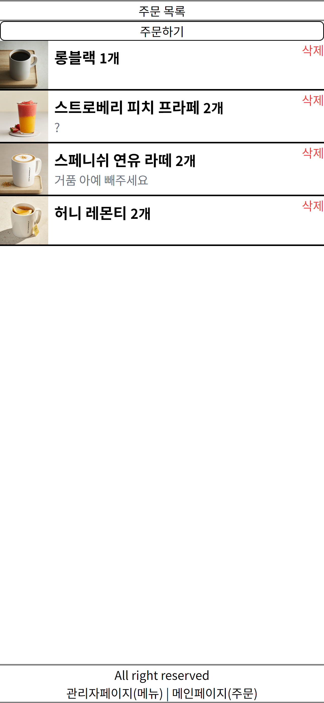

# 싸피 카페

싸피 카페의 메뉴와 주문을 관리할 수 있는 웹 애플리케이션입니다. 다양한 기능을 통해 메뉴와 주문을 효율적으로 처리할 수 있습니다.

## 기능

### 메뉴 관리

- **메뉴 조회**: 현재 등록된 메뉴를 확인할 수 있습니다.

- **메뉴 상세 조회**: 선택한 메뉴의 상세 정보를 확인할 수 있습니다. (이름, 설명, 사진 등)

- **메뉴 등록**: 메뉴의 이름, 설명, 사진을 등록하여 새로운 메뉴를 추가할 수 있습니다.

- **메뉴 삭제**: 메뉴 상세 조회 페이지에서 삭제 버튼을 통해 메뉴를 삭제할 수 있습니다.
- **메뉴 수정**: 메뉴 상세 조회 페이지에서 이름, 설명 또는 사진을 수정할 수 있습니다.

### 주문 관리

- **주문 조회**: 현재 접수된 주문을 확인할 수 있습니다.
- **주문 상세 조회**: 선택한 주문의 상세 정보를 확인할 수 있습니다. (메뉴, 수량, 요청사항 등)
- **주문 등록**: 메뉴를 선택하고, 수량과 요청사항을 입력하여 새로운 주문을 등록할 수 있습니다.
- **주문 삭제**: 주문 상세 조회 페이지에서 삭제 버튼을 통해 주문을 삭제할 수 있습니다.
- **주문 수정**: 주문 상세 조회 페이지에서 메뉴, 수량, 요청사항을 수정할 수 있습니다.

## 사용 방법

### 메뉴 조회

메뉴 관리 페이지에서 "메뉴 조회" 버튼을 클릭하여 현재 메뉴를 확인합니다.

### 메뉴 상세 조회

메뉴 목록에서 상세 조회하고자 하는 메뉴를 선택하여 상세 정보를 확인합니다.

### 메뉴 등록

메뉴 관리 페이지에서 "메뉴 등록" 버튼을 클릭하고, 메뉴 이름, 설명, 사진을 입력하여 새로운 메뉴를 추가합니다.

### 메뉴 수정

메뉴 상세 조회 페이지에서 이름, 설명, 또는 사진을 변경한 후 "메뉴 수정" 버튼을 클릭합니다.

### 메뉴 삭제

메뉴 상세 조회 페이지에서 "메뉴 삭제" 버튼을 클릭하여 메뉴를 삭제합니다.

### 주문 조회

주문 관리 페이지에서 "주문 조회" 버튼을 클릭하여 현재 주문을 확인합니다.

### 주문 상세 조회

주문 목록에서 상세 조회하고자 하는 주문을 선택하여 상세 정보를 확인합니다.

### 주문 등록

주문 관리 페이지에서 "주문 등록" 버튼을 클릭하고, 메뉴를 선택한 후 수량과 요청사항을 입력하여 새로운 주문을 추가합니다.

### 주문 수정

주문 상세 조회 페이지에서 메뉴, 수량, 요청사항을 변경한 후 "주문 수정" 버튼을 클릭합니다.

### 주문 삭제

주문 상세 조회 페이지에서 "주문 삭제" 버튼을 클릭하여 주문을 삭제합니다.
